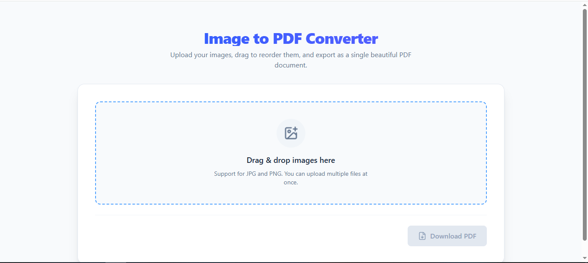
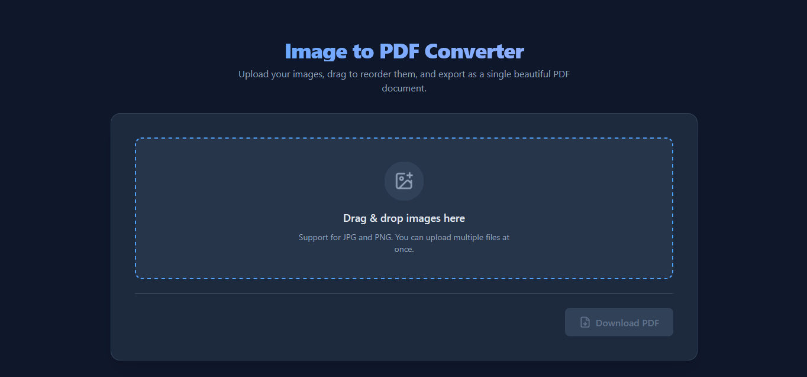

# ✨ Image To Pdf Converter

<h3 align="center">☀️ Light Mode</h3>

  

<h3 align="center">🌙 Dark Mode</h3>

  

<h3 align="center"> Introduction </h3>

 ​A modern, lightweight, and secure web application designed to simplify the process of converting images into high-quality PDF documents. Built with React.js, this tool focuses on a seamless user experience by allowing users to transform their visual files into organized documents directly in their browser. 

<h3 align="center"> 📦 Installation </h3>

<pre> 
cd your-project 
npm install
npm run dev 
</pre>

